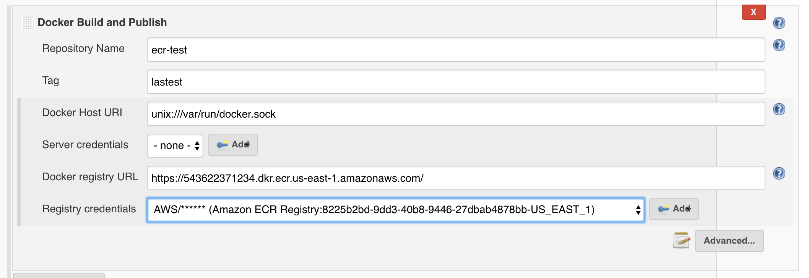

# Amazon ECR Plugin

This plugin offers integration with [Amazon Container Registry
(ECR)](https://aws.amazon.com/ecr/) as a [DockerRegistryToken] source to convert
Amazon Credentials into a Docker CLI Authentication Token.

[DockerRegistryToken]: https://github.com/jenkinsci/docker-commons-plugin/blob/master/src/main/java/org/jenkinsci/plugins/docker/commons/credentials/DockerRegistryToken.java

## About

Amazon ECR plugin implements a Docker Token producer to convert Amazon
credentials to Jenkins’ API used by (mostly) all Docker-related plugins.

Thank's to this producer, you can select your existing registered Amazon
credentials for various Docker operations in Jenkins, for sample using the
Docker Build and Publish plugin:



## Installation

Navigate to the "Plugin Manager" screen, install the "Amazon ECR" plugin and
restart Jenkins.

The plugin will use the proxy configured on Jenkins if it is set.

Recommended logger for troubleshooting, you have to take care where you publish
these logs could contain sensitive information

- com.cloudbees.jenkins.plugins.amazonecr
- com.amazonaws
- org.apache.http.wire
- org.jenkinsci.plugins.docker.workflow

## Docker Pipeline Usage

When using the [Docker Pipeline
Plugin](https://plugins.jenkins.io/docker-workflow/), in order to obtain an ECR
login credential, you must use the ecr provider prefix.

```groovy
docker.withRegistry("https://your.ecr.domain.amazonws.com", "ecr:us-east-1:credential-id") {
  docker.image("your-image-name").push()
}
```

If you experience authentication issues, you would try to remove user
docker configuration files on the agents before to run the docker
commands, something like this pipeline script.

```groovy
node {
  // cleanup current user docker credentials
  sh 'rm -f ~/.dockercfg ~/.docker/config.json || true'

  // configure registry
  docker.withRegistry('https://ID.ecr.eu-west-1.amazonaws.com', 'ecr:eu-west-1:86c8f5ec-1ce1-4e94-80c2-18e23bbd724a') {

    // build image
    def customImage = docker.build("my-image:${env.BUILD_ID}")

    // push image
    customImage.push()
  }
}
```

